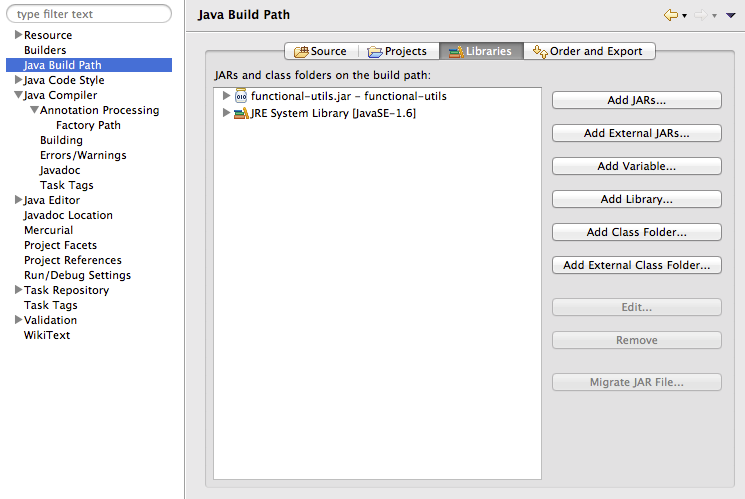
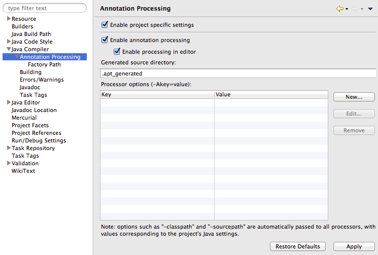
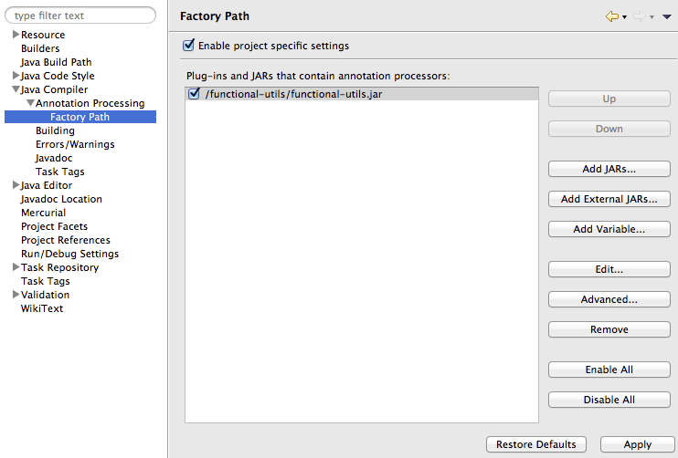

# A more-or-less functional util library for general use. Now with added code generation.

Code generation is highly recommended since it provides kind of poor-mans-first-class-functions in regular java code, thus greatly lessening the pain of using functional constructs. See examples for more info.

## Installing

> git clone git://github.com/solita/functional-utils.git

and use as a regular java project. Eclipse project/classpath files are included.

...or include as a jar file in the classpath. Bundled pom.xml can be used to package the jar, or just use [the latest ready-made file](functional-utils.jar)

You might also want to use *Eclipse favorites* (any similar thing in Idea?) so that you never have to write a single import clause.
Add the following types/functions to *Eclipse Preferences -> Java -> Editor -> Content Assist -> Favorites*:

If (and when) you want to use the standard Java library as first class functions, add [the ready-made metaclasses for JavaSE6](javase6meta.jar) to your classpath.
TODO: JavaSE7. 

## Code generation

### Eclipse (tested in Juno)

Create (or open an existing) Java project.

Add functional-utils as a project dependency (as a jar file or a project):

Project properties -> Java Compiler -> Annotation Processing:
<ul>
  <li>Enable project specific settings</li>
	<li>Enable annotation processing</li>
</ul>

Project properties -> Java Compiler -> Annotation Processing -> Factory Path:
<ul>
	<li>Enable project specific settings</li>
	<li>Add JARs... and select functiona-utils.jar</li>
</ul>

Now whenever you save a file the metadata classes are automatically generated and immediately ready for use.

### IntelliJ Idea

TODO: Anyone know how Idea supports Annotation Processors?

### Maven/Gradle/...

Please consult the documentation of your build tool on how to enable and control annotation processing.

### Metaclasses for 3rd party libraries?

Since I was able to generate the metaclasses for the standard Java library,
there's a good chance that it will also work for whichever 3rd party library where the source code is available.

## Examples

Just a few examples of using these utils.

### fi.solita.utils.functional.Collections

	List<Integer> emptyList = newList();
	Set<String> emptySet = newSet();
	Map<Long, Integer> emptyMap = newMap();

	int[] primitiveArray = new int[]{1, 2, 3};
	List<Integer> listFromPrimitives = newList(primitiveArray);
	Set<Integer> setFromPrimitives = newSet(primitiveArray);

	Iterable<Integer> iterable = newList(1, 2, 3);
	List<Integer> listFromIterable = newList(iterable);
	Set<Integer> setFromIterable = newSet(iterable);

	List<? extends Map.Entry<String, Integer>> entries = newList(Pair.of("foo", 1), Pair.of("bar", 2));
	Map<String, Integer> mapFromIterableEntries = newMap(entries);
	Map<String, Integer> mapFromEntries = newMap(Pair.of("foo", 1), Pair.of("bar", 2));

	Character[] arrayFromPrimitives = newArray('a', 'b', 'c');
	char[] primitiveArrayFromObjectArray = newArray(arrayFromPrimitives);
	Character[] objectArrayFromPrimitiveArray = newArray(primitiveArrayFromObjectArray);

	Iterable<Character> charSequenceToIterable = it("foo");

### fi.solita.utils.functional.Option

	Option<String> optionContainingFoo = Some("foo");
	Option<String> emptyOption = None();

	Option<String> valueResultsInSome = Option.of("foo");
	Option<Object> nullResultsInNone = Option.of(null);

	String string = optionContainingFoo.get();
	try { 
	    emptyOption.get();
	} catch (UnsupportedOperationException e) {}

	String foo = optionContainingFoo.getOrElse("bar");
	String bar = emptyOption.getOrElse("bar");

	boolean someIsDefined = Some("foo").isDefined();
	boolean noneIsNotDefined = None().isDefined();

	for (String str: optionContainingFoo) {
	    // executed once
	}

	for (String str: emptyOption) {
	    // never executed
	}

### fi.solita.utils.functional.Compare

	static class Employee {
		public int salary;
		public Option<String> name;
	}

	// ...

	Ordering<Comparable<?>> byNaturalOrdering = Compare.byNatural();
	Ordering<Employee> byComparable = Compare.by(Employee_.salary);
	Ordering<Employee> byExplicitComparator = Compare.by(Employee_.salary, Ordering.Natural());

	Ordering<_1<? extends Comparable<?>>> by_1 = Compare.by_1;

	List<Tuple2<String, Employee>> listOfTuples = newList();
	sort(listOfTuples, by_1);
	// Employee does not implement comparable, but we can first map to _2 and then to salary
	sort(listOfTuples, Compare.by(Tuple2_.<String,Employee>_2().andThen(Employee_.salary)));

	// sorted by the contents of an iterable
	sort(Collections.<List<String>>newList(), Compare.<String>byIterable());

	// sorted by the contents of an Option
	sort(Collections.<Option<String>>newList(), Compare.<String>byOption());

	// sorted by a function to an Option
	sort(Collections.<Employee>newList(), Compare.byOption(Employee_.name));

	// and the same with explicit comparators
	sort(Collections.<List<Employee>>newList(), Compare.byIterable(Compare.by(Employee_.salary)));
	sort(Collections.<Option<Employee>>newList(), Compare.byOption(Compare.by(Employee_.salary)));
	sort(Collections.<Employee>newList(), Compare.byOption(Employee_.name, Ordering.Natural()));

### fi.solita.utils.functional.Functional

TODO

## Word of warning

This package comes with no warranty what-so-ever. It's higly experimental, might contain loads of bugs and needs more testing.
Packages and classes may get renamed or moved, and things may suddenly break.
Use at your own risk!

And no, I honestly do not believe that Java is the language of the future. Please use a "real" language if you can.
But if you are stuck in the enterprise world, this project might just make your life worth living.

Bug reports, feature requests and opinionated recommendations are highly welcome ;)

## License

Copyright © Solita Oy

Distributed under the MIT License.
