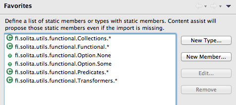

# More-or-less functional util library for Java.

Code generation (https://github.com/solita/meta-utils) is highly recommended since it provides first-class-functions in regular java code, thus greatly lessening the pain of using functional constructs.

## Installing

Add the following file (or the latest version) to classpath:

https://github.com/solita/functional-utils/releases/download/0.8/functional-utils-0.8.jar

You might also want to use *Eclipse favorites* (any similar thing in Idea?) so that you don't jave to write so many import clauses.
Add the following types/functions to *Eclipse Preferences -> Java -> Editor -> Content Assist -> Favorites*:

## Examples

Just a few examples of using these utils.

* [Builders and Lenses](#user-content-fisolitautilsfunctionallensbuilder-and-fisolitautilsfunctionallenslens)
* [Collections] (#user-content-fisolitautilsfunctionalcollections)
* [Option] (#user-content-fisolitautilsfunctionaloption)
* [Comparisons] (#user-content-fisolitautilsfunctionalcompare)
* [Tuples] (#user-content-fisolitautilsfunctionaltuple)
* [Functions] (#user-content-fisolitautilsfunctionalfunction)
* [Monoids] (#user-content-fisolita.utilsfunctionalmonoid)
* [Pattern matching] (#user-content-fisolitautilsfunctionalmatch)
* [Common functional stuff] (#user-content-fisolitautilsfunctionalfunctional)

### fi.solita.utils.functional.lens.Builder and fi.solita.utils.functional.lens.Lens
	class Department {
	    final String name;
	    final List<Employee> employees;
	
	    public static final Builder<Department> builder = Builder.of(Department_.$Fields(), Department_.$);
	    
	    public Department(String name, List<Employee> employees) {
	        this.name = name;
	        this.employees = employees;
	    }
	    
	    public Department(String name) {
	        this.name = name;
	        this.employees = Collections.emptyList();
	    }
	}
	
	class Employee {
	    final String name;
	    final Option<Integer> salary;
	    final Department department;
	    
	    public static final Builder<Employee> builder = Builder.of(Employee_.$Fields(), Employee_.$);
	
	    public Employee(String name, Option<Integer> salary, Department department) {
	        this.name = name;
	        this.salary = salary;
	        this.department = department;
	    }
	}
	
	/** Generated in practice by meta-utils */
	class Department_ {
	    public static final Tuple2<Apply<Department,String>,Apply<Department,List<Employee>>> $Fields() {
	        return Tuple.of(name, employees);
	    }
	    public static final Function2<String, List<Employee>, Department> $ = new Function2<String, List<Employee>, Department>() {
	        public Department apply(String t, List<Employee> e) {
	            return new Department(t, e);
	        }
	    };
	    public static final Apply<Department, String> name = new Apply<Department, String>() {
	        public String apply(Department t) {
	            return t.name;
	        }
	    };
	    public static final Apply<Department, List<Employee>> employees = new Apply<Department, List<Employee>>() {
	        public List<Employee> apply(Department t) {
	            return t.employees;
	        }
	    };
	}
	
	/** Generated in practice by meta-utils */
	class Employee_ {
	    public static final Tuple3<Apply<Employee,String>,Apply<Employee,Option<Integer>>,Apply<Employee,Department>> $Fields() {
	        return Tuple.of(name, salary, department);
	    }
	    public static final Function3<String, Option<Integer>, Department, Employee> $ = new Function3<String,Option<Integer>,Department,Employee>() {
	        public Employee apply(String t1, Option<Integer> t2, Department t3) {
	            return new Employee(t1, t2, t3);
	        }
	    };
	    public static final Apply<Employee, String> name = new Apply<Employee, String>() {
	        public String apply(Employee t) {
	            return t.name;
	        }
	    };
	    public static final Apply<Employee, Option<Integer>> salary = new Apply<Employee, Option<Integer>>() {
	        public Option<Integer> apply(Employee t) {
	            return t.salary;
	        }
	        @SuppressWarnings("unused")
	        public Member getMember() {
	            try {
	                return Employee.class.getDeclaredField("salary");
	            } catch (NoSuchFieldException e) {
	                throw new RuntimeException(e);
	            }
	        }
	    };
	    public static final Apply<Employee, Department> department = new Apply<Employee, Department>() {
	        public Department apply(Employee t) {
	            return t.department;
	        }
	    };
	}
	
	public class BuilderAndLensExamples {
	
	    @Test
	    public void builder() {
	        Employee employee = Builder.of(Employee_.$Fields(), Employee_.$)
	            .with(Employee_.name, "John")
	            .without(Employee_.salary)
	            .with(Employee_.department, new Department("Sales"))
	            .build();
	        assertEquals("John", employee.name);
	        assertEquals(None(), employee.salary);
	        assertEquals("Sales", employee.department.name);
	    }
	    
	    @Test
	    public void lens() {
	        Employee employee = new Employee("John", Some(42), new Department("Sales"));
	        Lens<Employee,String> name_ = Lens.of(Employee_.name, Employee.builder);
	
	        assertEquals("John", employee.name);
	        assertEquals("John", name_.get(employee));
	
	        Employee newEmployee = name_.set(employee, "Jane");
	        assertEquals("Jane", newEmployee.name);
	    }
	
	    @Test
	    public void deepLens() {
	        Employee employee = new Employee("John", Some(42), new Department("Sales"));
	
	        Lens<Employee, Department> employeeDepartment_ = Lens.of(Employee_.department, Employee.builder);
	        Lens<Department, String> departmentName_ = Lens.of(Department_.name, Department.builder);
	        Lens<Employee, String> employeeDepartmentName_ = employeeDepartment_.andThen(departmentName_);
	
	        assertEquals("Sales", employeeDepartmentName_.get(employee));
	
	        Employee newEmployee = employeeDepartmentName_.set(employee, "IT");
	        assertEquals("IT", newEmployee.department.name);
	    }
	    
	    @Test
	    public void listLens() {
	        Department department = new Department("Sales", newList(new Employee("John", Some(42), new Department("IT"))));
	
	        Lens<Department, List<Employee>> departmentEmployees_ = Lens.of(Department_.employees, Department.builder);
	        Lens<Employee, Option<Integer>> employeeSalary_ = Lens.of(Employee_.salary, Employee.builder);
	
	        assertEquals(newSet(42), newSet(flatMap(Employee_.salary, departmentEmployees_.get(department))));
	
	        
	        Setter<Department,Option<Integer>> departmentSalaries_ = Lens.eachList(departmentEmployees_, employeeSalary_);
	        assertEquals(newSet(69), newSet(flatMap(Employee_.salary, departmentSalaries_.set(department, Some(69)).employees)));
	        
	        
	        Lens<Department, String> departmentName_ = Lens.of(Department_.name, Department.builder);
	        Lens<Employee, Department> employeeDepartment_ = Lens.of(Employee_.department, Employee.builder);
	        
	        Setter<Department,Department> departmentEmployeeDepartments_ = Lens.eachList(departmentEmployees_, employeeDepartment_);
	        Setter<Department,String> departmentEmployeeDepartmentsName_ = departmentEmployeeDepartments_.andThen(departmentName_);
	        
	        assertEquals(newSet("IT2"), newSet(map(Department_.name, map(Employee_.department, departmentEmployeeDepartmentsName_.set(department, "IT2").employees))));
	    }
	}

### fi.solita.utils.functional.Collections

	List<Integer> emptyList = newList();
	Set<String> emptySet = newSet();
	Map<Long, Integer> emptyMap = newMap();

	int[] primitiveArray = new int[]{1, 2, 3};
	List<Integer> listFromPrimitives = newList(primitiveArray);
	Set<Integer> setFromPrimitives = newSet(primitiveArray);

	Iterable<Integer> iterable = newList(1, 2, 3);
	List<Integer> listFromIterable = newList(iterable);
	Set<Integer> setFromIterable = newSet(iterable);

	List<? extends Map.Entry<String, Integer>> entries = newList(Pair.of("foo", 1), Pair.of("bar", 2));
	Map<String, Integer> mapFromIterableEntries = newMap(entries);
	Map<String, Integer> mapFromEntries = newMap(Pair.of("foo", 1), Pair.of("bar", 2));

	Character[] arrayFromPrimitives = newArray('a', 'b', 'c');
	char[] primitiveArrayFromObjectArray = newArray(arrayFromPrimitives);
	Character[] objectArrayFromPrimitiveArray = newArray(primitiveArrayFromObjectArray);

	Iterable<Character> charSequenceToIterable = it("foo");

### fi.solita.utils.functional.Option

	Option<String> optionContainingFoo = Some("foo");
	Option<String> emptyOption = None();

	Option<String> valueResultsInSome = Option.of("foo");
	Option<Object> nullResultsInNone = Option.of(null);

	String string = optionContainingFoo.get();
	try { 
	    emptyOption.get();
	} catch (UnsupportedOperationException e) {}

	String foo = optionContainingFoo.getOrElse("bar");
	String bar = emptyOption.getOrElse("bar");

	boolean someIsDefined = Some("foo").isDefined();
	boolean noneIsNotDefined = None().isDefined();

	for (String str: optionContainingFoo) {
	    // executed once
	}

	for (String str: emptyOption) {
	    // never executed
	}

### fi.solita.utils.functional.Compare

	static class Employee {
		public int salary;
		public Option<String> name;
	}

	// ...

	Ordering<Comparable<?>> byNaturalOrdering = Compare.byNatural();
	Ordering<Employee> byComparable = Compare.by(salary);
	Ordering<Employee> byExplicitComparator = Compare.by(salary, Ordering.Natural());

	Ordering<_1<? extends Comparable<?>>> by_1 = Compare.by_1;

	List<Tuple2<String, Employee>> listOfTuples = newList();
	sort(by_1, listOfTuples);
	// Employee does not implement comparable, but we can first map to _2 and then to salary
	sort(Compare.by(Transformers.<Employee>_2().andThen(salary)), listOfTuples);

	// sorted by the contents of an iterable
	sort(Compare.<String>byIterable(), Collections.<List<String>>newList());

	// sorted by the contents of an Option
	sort(Compare.<String>byOption(), Collections.<Option<String>>newList());

	// sorted by a function to an Option
	sort(Compare.byOption(name), Collections.<Employee>newList());

	// and the same with explicit comparators
	sort(Compare.byIterable(Compare.by(salary)), Collections.<List<Employee>>newList());
	sort(Compare.byOption(Compare.by(salary)), Collections.<Option<Employee>>newList());
	sort(Compare.byOption(name, Ordering.Natural()), Collections.<Employee>newList());

### fi.solita.utils.functional.Tuple

	Tuple1<String> tuple1 = Tuple.of("foo");
	Map.Entry<String,String> tuple2extendsMapEntry = Tuple.of("a", "b");
	Tuple2<String,String> pairExtendsTuple2 = Pair.of("left", "right");
	// ... until Tuple22

	// a List of common supertype
	List<String> strings = Tuple.asList(Tuple.of("str1", "str2"));
	List<? extends Object> objects = Tuple.asList(Tuple.of(42, "foo"));
	List<? extends Number> numbers = Tuple.asList(Tuple.of(42, 42l));

	Object[] values = Tuple.of("str").toArray();

	Tuple3<Integer,String,Boolean> tuple = Tuple.of(42, "b", true);
	String valueByFieldAccess = tuple._2;

	Pair<Integer,String> pair = Pair.of(42, "right");
	String right = pair.right;
	int left = pair.left;

	Tuple2<String, Integer> appendedRight = Tuple.of("str").append(42);
	Tuple3<Boolean, String, Integer> prependedLeft = appendedRight.prepend(true);

	Tuple4<Integer, String, Boolean, Object> bigtuple = Tuple.of(42, "str", true, new Object());
	Tuple2<Integer,String> prefix2 = bigtuple.take2();
	Tuple3<Integer, String, Boolean> prefix3 = bigtuple.take3();

	List<Pair<String,Integer>> listOfTuples = newList();
	Iterable<Integer> projection = map(listOfTuples, Transformers.<Integer>_2());

### fi.solita.utils.functional.Function

	static Transformer<String,Integer> length = new Transformer<String,Integer>() {
	    @Override
	    public Integer transform(String source) {
	        return source.length();
	    }
	};

	static Function2<Integer,Integer,Integer> mod = new Function2<Integer,Integer,Integer>() {
	    @Override
	    public Integer apply(Integer modulus, Integer i) {
	        return i % modulus;
	    }
	};
  
	//...  

	// Apply<T,R> is a function from T to R
	Apply<String,Integer> f = length;

	// Function0 ia a 0-arg function, Function1 1-arg, Function2 2-arg, etc.
	Function0<Integer> zeroArg = Function.of(42);
	Function1<String,Integer> oneArg = length;
	Function2<Integer, Integer, Integer> twoArg = mod;

	int applied = length.apply("foo");
	Iterable<Integer> mappedOverFunction = map(f, newList("a", "aa"));

	Function0<Integer> partiallyApplied = length.ap("foo");
	int result = partiallyApplied.apply();
	Function1<Integer, Integer> modulo42 = mod.ap(42);

	Function1<Integer, Integer> partiallyApplyFirstParam = mod.apply(42, _);
	Function1<Integer, Integer> partiallyApplySecondParam = mod.apply(_, 84);
	// a function can also be split to two functions, dividing some params
	// to the first one and others to the second one:
	Function1<Integer, Function1<Integer, Integer>> split = mod.apply(__, _);

	// function composition, one way or the other
	Function1<String, String> func = Function.id();
	Function1<String, Integer> composed = func.andThen(length);
	Function1<String, Integer> composed2 = length.compose(func);

	// multi-param function can be views as a 1-arg function of a Tuple:
	Function2<Integer,Integer,Integer> m = mod;
	Function1<Tuple2<Integer,Integer>,Integer> tuppled = m.tuppled();

	Function2<Integer,Integer,Integer> twoArgFunction = mod;
	Function1<Integer,Function1<Integer,Integer>> curried = twoArgFunction.curried();

### fi.solita.utils.functional.Monoid

	static class Distance implements SemiGroup<Distance> {
		public final int meters;
		
		public Distance(int meters) {
			this.meters = meters;
		}
		
		@Override
		public Distance apply(final Tuple2<Distance, Distance> t) {
			return new Distance(t._1.meters + t._2.meters);
		}
	}
	
	//...
	
	List<Long> longs = newList(1l, 2l);

	// Longs (if assumed unbounded), Booleans and Strings are monoids,
	// but they do not have "default instances of Monoid typeclass" so we
	// must give one as a parameter.
	long three = reduce(Monoids.longSum, longs);
	long two = reduce(Monoids.longProduct, longs);
	boolean notTrue = reduce(Monoids.booleanConjunction, newList(true, false));
	String foobar = reduce(Monoids.stringConcat, newList("foo", "bar"));

	// For classes having a default (SemiGroup) instance,
	// no parameter is needed.
	List<Distance> distances = newList(new Distance(1), new Distance(2));
	Option<Distance> reduced = reduce(distances);

	Map<String, Long> first = newMap();
	Map<String, Long> second = newMap();
	Map<String, Long> valuesSummed = reduce(Monoids.<String,Long>mapCombine(SemiGroups.longSum), newList(first, second));

### fi.solita.utils.functional.Match
	for (Integer m: Match.instance(Integer.class, (Object)42)) {
		// executed only if object is an Integer 
	}
	
	for (Integer m: Match.singleton(newList(1))) {
		// executed only if the given iterable contains exactly one item
	}
	
	for (Pair<Integer, Integer> m: Match.pair(newList(1,2))) {
		// executed only if the given iterable contains exactly two items
	}
	
	for (Pair<Integer,Integer> m: Match.iterable(1, null, newList(1,2))) {
		// executed only if the iterable (last parameter) contains exactly as many
		// elements as given as previous parameters, and all non-null values
		// are equal to the corresponding element in the iterable.
		//
		// So, you can use nulls to mean "this element can be anything"
	}

### fi.solita.utils.functional.Functional

	// head
	int head = head(someIterableOrArray);
	assertEquals(1, head);

	// headOption
	Option<Integer> headOption = headOption(someIterableOrArray);
	assertEquals(Some(1), headOption);
	assertEquals(None(), headOption(emptyList()));

	// last
	int last = last(someIterableOrArray);
	assertEquals(3, last);

	// lastOption
	Option<Integer> lastOption = lastOption(someIterableOrArray);
	assertEquals(Some(3), lastOption);
	assertEquals(None(), lastOption(emptyList()));

	// tail
	Iterable<Integer> tail = tail(someIterableOrArray);
	assertEquals(newList(2,3), newList(tail));

	// init
	Iterable<Integer> init = init(someIterableOrArray);
	assertEquals(newList(1,2), newList(init));

	// take
	Iterable<Integer> take = take(2, someIterableOrArray);
	assertEquals(newList(1,2), newList(take));

	// takeWhile
	Iterable<Integer> takeWhile = takeWhile(odd, someIterableOrArray);
	assertEquals(newList(1), newList(takeWhile));

	// drop
	Iterable<Integer> drop = drop(1, someIterableOrArray);
	assertEquals(newList(2,3), newList(drop));

	// dropWhile
	Iterable<Integer> dropWhile = dropWhile(odd, someIterableOrArray);
	assertEquals(newList(2,3), newList(dropWhile));

	// span
	Pair<Iterable<Integer>, Iterable<Integer>> span = span(odd, someIterableOrArray);
	assertEquals(Pair.of(newList(1),         newList(2,3)),
	             Pair.of(newList(span.left), newList(span.right)));

	// isEmpty
	boolean isEmpty = isEmpty(someIterableOrArray);
	assertEquals(false, isEmpty);

	// containment
	boolean contains = contains(1, someIterableOrArray);
	assertEquals(true, contains);

	// size
	long size = size(someIterableOrArray);
	assertEquals(3l, size);

	// cons
	Iterable<Integer> cons = cons(0, someIterableOrArray);
	assertEquals(newList(0,1,2,3), newList(cons));

	// concat
	Iterable<Integer> concat = concat(someIterableOrArray, someIterableOrArray);
	assertEquals(newList(1,2,3,1,2,3), newList(concat));

	// find
	Option<Integer> find = find(even, someIterableOrArray);
	Option<String> findFromMap = find(42, someMap);
	assertEquals(Some(2), find);
	assertEquals(Some("foo"), findFromMap);
	assertEquals(None(), find(even, Collections.<Integer>emptyList()));

	// filter
	Iterable<Integer> filter = filter(odd, someIterableOrArray);
	Map<Integer, String> filterFromMap = filter(evenKey, someMap);
	assertEquals(newList(1,3), newList(filter));
	assertEquals(newMap(Pair.of(42, "foo")), filterFromMap);

	// exists
	boolean exists = exists(even, someIterableOrArray);
	assertEquals(true, exists);

	// forall
	boolean forall = forall(even, someIterableOrArray);
	assertEquals(false, forall);

	// foreach
	foreach(someProcedure, someIterableOrArray);

	// map
	Iterable<Integer> map = map(negateInt, someIterableOrArray);
	Map<Integer, String> mapOfMap = map(Function.<Map.Entry<Integer, String>>id(), someMap);
	Iterable<Pair<Integer, Integer>> mapMultiple = map(negateInt, negateInt.andThen(negateInt), someIterableOrArray);
	assertEquals(newList(-1,-2,-3), newList(map));
	assertEquals(newMap(Pair.of(42, "foo")), mapOfMap);
	assertEquals(newList(Pair.of(-1,1), Pair.of(-2,2), Pair.of(-3,3)), newList(mapMultiple));

	// flatMap
	Iterable<Integer> flatMap = flatMap(repeatTwice, someIterableOrArray);
	assertEquals(newList(1,1,2,2,3,3), newList(flatMap));

	// flatten
	Iterable<Integer> flatten = flatten(map(repeatTwice, someIterableOrArray));
	Iterable<Integer> flattenArrays = flatten(new Integer[][]{new Integer[]{1}, new Integer[]{2}});
	assertEquals(newList(1,1,2,2,3,3), newList(flatten));
	assertEquals(newList(1,2), newList(flattenArrays));

	// fold
	Option<Integer> fold = fold(SemiGroups.intSum, someIterableOrArray);
	String foldFromZero = fold("->", SemiGroups.stringConcat, map(Transformers.toString, someIterableOrArray));
	assertEquals(Some(6), fold);
	assertEquals("->123", foldFromZero);

	// reduce
	long reduce = reduce(Monoids.longSum, map(Transformers.int2long, someIterableOrArray));
	assertEquals(6l, reduce);

	// union
	Set<Integer> union = union(newSet(1,2), newSet(2,3));
	assertEquals(newSet(1,2,3), union);

	// intersection
	Set<Integer> intersection = intersection(newSet(1,2), newSet(2,3));
	assertEquals(newSet(2), intersection);

	// subtract
	Iterable<Integer> subtract = subtract(someIterableOrArray, newList(2));
	assertEquals(newList(1,3), newList(subtract));

	// min
	Option<Integer> min = min(someIterableOrArray);
	assertEquals(Some(1), min);
	assertEquals(None(), min(Collections.<Integer>emptyList()));

	// max
	Option<Integer> max = max(someIterableOrArray);
	assertEquals(Some(3), max);
	assertEquals(None(), max(Collections.<Integer>emptyList()));

	// sum
	long sum = sum(1,2,3);
	assertEquals(6l, sum);

	// product
	long product = product(1,2,3);
	assertEquals(6l, product);

	// sort
	Iterable<Integer> sort = sort(someIterableOrArray);
	Iterable<Integer> sortBy = sort(Compare.byNatural().reverse(), someIterableOrArray);
	assertEquals(newList(1,2,3), newList(sort));
	assertEquals(newList(3,2,1), newList(sortBy));

	// reverse
	// repeat
	// range
	// sequence
	// distinct

	// zip
	// zipWithIndex
	// transpose
	// groupBy
	// grouped

	// mkString
	// unlines

## Word of warning

This package comes with no warranty what-so-ever. It's higly experimental, might contain loads of bugs and needs more testing.
Packages and classes may get renamed or moved, and things may suddenly break.
Use at your own risk!

Bug reports, feature requests and opinionated recommendations are highly welcome ;)

## License

Copyright © Solita Oy

Distributed under the MIT License.
